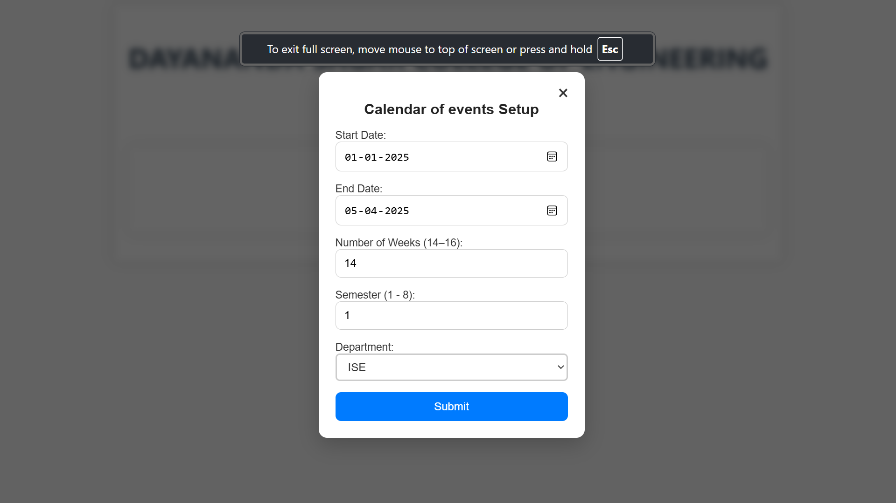
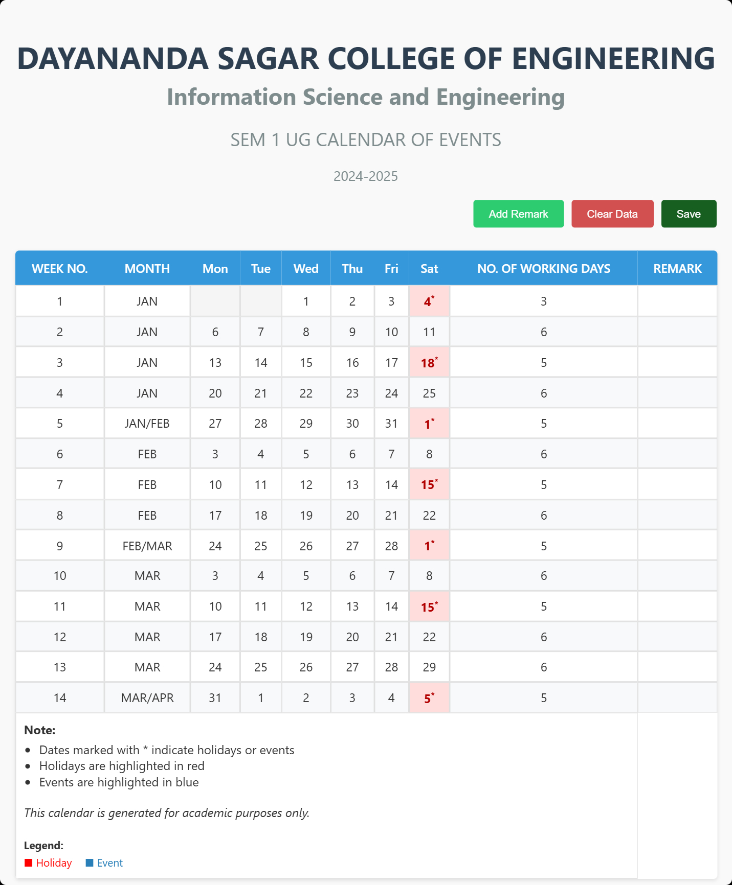

# Academic Calendar Generator


A web-based application for generating academic calendars with event and holiday management capabilities.

## Features

- 📅 Create semester calendars spanning 14-16 weeks
- 🏫 Department-specific calendar generation
- 🎯 Mark holidays and academic events
- ⚠️ Automatic conflict detection for dates
- 📤 Export calendar as JPEG image
- 📱 Responsive design for all devices

## Installation

1. Clone the repository:

      ```bash
      git clone https://github.com/your-username/academic-calendar-generator.git
      cd academic-calendar-generator
      ```

2. Install dependencies:

      ```bash
      npm install
      ```

3. Start the development server:

      ```bash
      npm start
      ```

4. Open [http://localhost:3000](http://localhost:3000) in your browser.

## Usage

1. Click "Generate Calendar" to set up a new academic calendar
2. Enter:

      - Start and end dates (must span 14-16 weeks)
      - Semester number (1-8)
      - Department (CSE/ISE)
      - Academic year

3. Use the interface to:
      - Add holidays/events with the "Add Remark" button
      - Clear all data with "Clear Data"
      - Export the calendar with "Save"

## Screenshots


_Initial setup interface_


_Main calendar interface_


_Adding a new event/holiday_

## Technologies Used

- **Frontend**: React.js
- **Date Handling**: Custom date utilities
- **Styling**: CSS Modules
- **Export**: html-to-image library
- **UI Components**: React Modal

## Project Structure

```
src/
├── components/
│   ├── CalendarComponent.jsx
│   ├── RemarkModal.jsx
│   ├── SetupModal.jsx
│   └── ...
├── utils/
│   ├── dateUtils.js
│   ├── dateRangeUtils.js
│   └── dateComparisonUtils.js
├── styles/
│   ├── CalendarComponent.css
│   ├── RemarkModal.css
│   └── SetupModal.css
└── App.js
```

## Dependencies

- react
- react-dom
- html-to-image
- date-fns (for date operations)

## Contributing

Contributions are welcome! Please follow these steps:

1. Fork the project
2. Create your feature branch (`git checkout -b feature/AmazingFeature`)
3. Commit your changes (`git commit -m 'Add some AmazingFeature'`)
4. Push to the branch (`git push origin feature/AmazingFeature`)
5. Open a Pull Request

## License

Distributed under the MIT License. See `LICENSE` for more information.

## Contact

Your Name - [@yourtwitter](https://twitter.com/yourtwitter) - your.email@example.com

Project Link: [https://github.com/your-username/academic-calendar-generator](https://github.com/your-username/academic-calendar-generator)

## Conclusion

The Academic Calendar Generator project successfully delivers a robust solution for academic institutions to manage and generate semester calendars. The application provides an intuitive interface for creating department-specific calendars, managing academic events, and handling holidays. Key achievements include:

- Successful implementation of a responsive web application using React.js
- Efficient date handling and conflict detection system
- Seamless calendar export functionality
- User-friendly interface for event management
- Cross-browser compatibility and mobile responsiveness

The project demonstrates the effective use of modern web technologies and best practices in software development, resulting in a practical tool that addresses real-world academic scheduling needs.

## Future Scope

The project has several potential areas for enhancement and expansion:

1. **Enhanced Calendar Features**
   - Integration with popular calendar applications (Google Calendar, Outlook)
   - Support for recurring events and custom event categories
   - Advanced conflict resolution suggestions
   - Multi-semester calendar planning

2. **User Management**
   - User authentication and role-based access control
   - Department-specific user permissions
   - User activity tracking and audit logs

3. **Advanced Export Options**
   - Multiple export formats (PDF, Excel, iCal)
   - Customizable calendar templates
   - Batch export functionality

4. **Integration Capabilities**
   - API endpoints for third-party integration
   - Webhook support for event notifications
   - Integration with academic management systems

5. **Analytics and Reporting**
   - Calendar usage statistics
   - Event attendance tracking
   - Custom report generation

6. **Mobile Application**
   - Native mobile apps for iOS and Android
   - Offline calendar access
   - Push notifications for events

7. **Accessibility Improvements**
   - Enhanced screen reader support
   - Keyboard navigation improvements
   - High contrast mode

8. **Internationalization**
   - Multi-language support
   - Region-specific holiday calendars
   - Time zone management

These enhancements would further improve the application's utility and make it an even more comprehensive solution for academic calendar management.

## Acknowledgments

- [React Documentation](https://reactjs.org/docs/getting-started.html)
- [date-fns](https://date-fns.org/) for date formatting inspiration
- [html-to-image](https://github.com/bubkoo/html-to-image) for export functionality

---

**Note**: For detailed documentation, please refer to the project report in the `docs/` folder.
